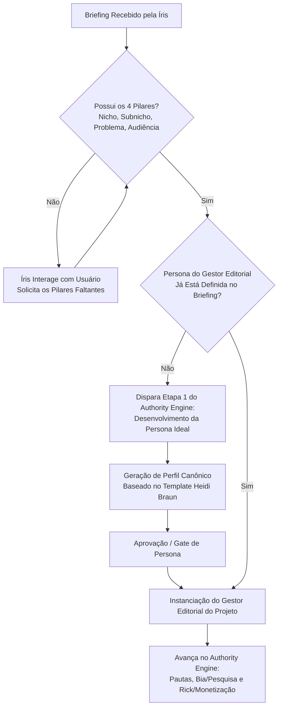

# MP-001 — Authority Engine: Intake da Íris & Instanciação de Gestores Editoriais

## 1. Visão Geral e Arquitetura do Start

O **Authority Engine** é o primeiro estágio da esteira operacional do FBR Agency Flux. Sua missão é transformar uma oportunidade de mercado em autoridade sólida, conteúdo de alta conversão e presença de marca.

A agente **Íris** atua como a coordenadora de intake. Ao receber o briefing de um novo projeto ou pauta, a Íris não inicia execuções cegas: ela interage com o usuário ou valida o payload para garantir que as bases indispensáveis estejam estabelecidas.

---

## 2. A Função Genérica "Gestor Editorial" vs. Instâncias por Projeto

> [!IMPORTANT]
> **"Gestor Editorial" é uma função/classe operacional genérica**, e não um agente único fixo.
> Cada projeto ou blog na agência possui a sua própria instância de Gestor Editorial com identidade, tom de voz e diretrizes visuais próprias.

### Exemplos de Instanciação:
- **Projeto "After Forty"**: Gestora Editorial = **Heidi Braun** (`afterfortyheidi`)
  - *Identidade*: Mulher de 50 anos, estética minimalista/sofisticada, guia experiente em longevidade e vitalidade.
  - *Contexto*: `02-prd/HeidiBraun.md` e `knowledge/afterfortyheidi/projetos/after-forty-context.md`.
- **Novos Projetos / Outros Nichos**:
  - Ex: *Projeto Finanças / Tech / Pet* → Receberá um novo Gestor Editorial (ex: *Lucas Ramos, Clara Dupont, etc.*) instanciado com as mesmas regras estruturais de governança.

---

## 3. Os 4 Pilares Mínimos de Start do Authority Engine

Para que a esteira do Authority Engine seja iniciada, a Íris exige obrigatoriamente 4 dados fundamentais do projeto:

1. **Nicho**: O mercado macro de atuação (ex: Longevidade e Bem-Estar 40+, Finanças Pessoais, Home Fitness).
2. **Subnicho**: A especialidade de ataque e posicionamento (ex: Microcorrente facial e biohacking para mulheres 45+).
3. **Qual Problema o projeto se propõe a resolver**: A dor central, fricção ou transformação buscada pela audiência (ex: A visão de que envelhecer é declínio inevitável vs. fase de controle, beleza natural e vitalidade).
4. **Qual é a Audiência que precisa (ou nem sabe que precisa) resolver esse problema**: O perfil demográfico e comportamental do público-alvo (ex: Mulheres 45-60 anos ativas que buscam soluções não invasivas e evidências científicas).

---

## 4. Árvore de Decisão da Íris no Intake

---

## 5. Ciclo de Vida: Criação de um Novo Gestor Editorial

Quando o projeto não possui uma persona pronta, o Authority Engine executa a criação seguindo o padrão canônico (`02-prd/TEMPLATE-GESTOR-EDITORIAL.md`):

1. **Core Identity**: Nome, idade, tom de voz, arquétipo e posicionamento.
2. **Visual Signature (Fixed Reference)**: Descritores físicos precisos (rosto, olhos, cabelo, expressão, vestuário) para consistência visual em IA gerativa.
3. **Brand Scenarios**: Cenários de conteúdo, iluminação e fotografia editorial.
4. **Compliance & Limites Éticos**: Disclaimer oficial, separação de afirmações factuais de produtos, proibição de falsos depoimentos milagrosos.
