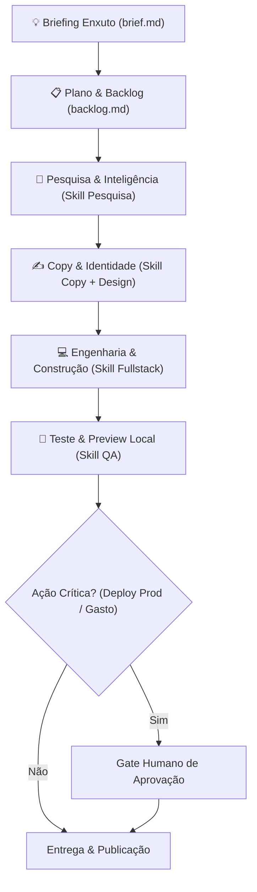

# Fluxo Operacional: Como um Projeto Acontece

---

## Passo a Passo Prático

### Etapa 1: Intake & Briefing (`brief.md`)
Um único arquivo markdown definindo:
- **Nome do Projeto**: Ex: *After Forty*.
- **Objetivo Central**: Ex: Blog de estilo de vida, saúde e investimentos para público 40+.
- **Público & Proposta de Valor**: Dores, desejos e diferenciais.
- **Entregáveis do Projeto**: Lista de itens tangíveis (Site Next.js, 10 Artigos, Identidade Visual, Integração de Afiliados).

### Etapa 2: Backlog de Execução (`backlog.md`)
Uma lista direta em markdown com checkboxes acionáveis. Cada item aponta para um artefato físico a ser criado dentro da pasta do projeto.

### Etapa 3: Execução das Frentes (Sem Trocação de Bastão Engessada)
O agente consulta a pasta `02-skills/` relevante e gera o artefato:
- `03-projetos/<projeto>/01-pesquisa/` ➔ Análise de mercado e benchmarks.
- `03-projetos/<projeto>/02-conteudo/` ➔ Textos, pautas, headlines e copys.
- `03-projetos/<projeto>/03-design-ui/` ➔ Guia de estilo, cores, tipografia e assets.
- `03-projetos/<projeto>/04-site/` ➔ Código-fonte da aplicação ou blog.

### Etapa 4: Validação & Preview
- O código é executado localmente.
- O agente valida se os requisitos foram atendidos e se o design/experiência estão excelentes.

### Etapa 5: Gate Único de Publicação/Deploy
- Apresenta-se o preview final com o sumário de entregas.
- Com a aprovação, o deploy ou a ativação de campanhas é disparada.
