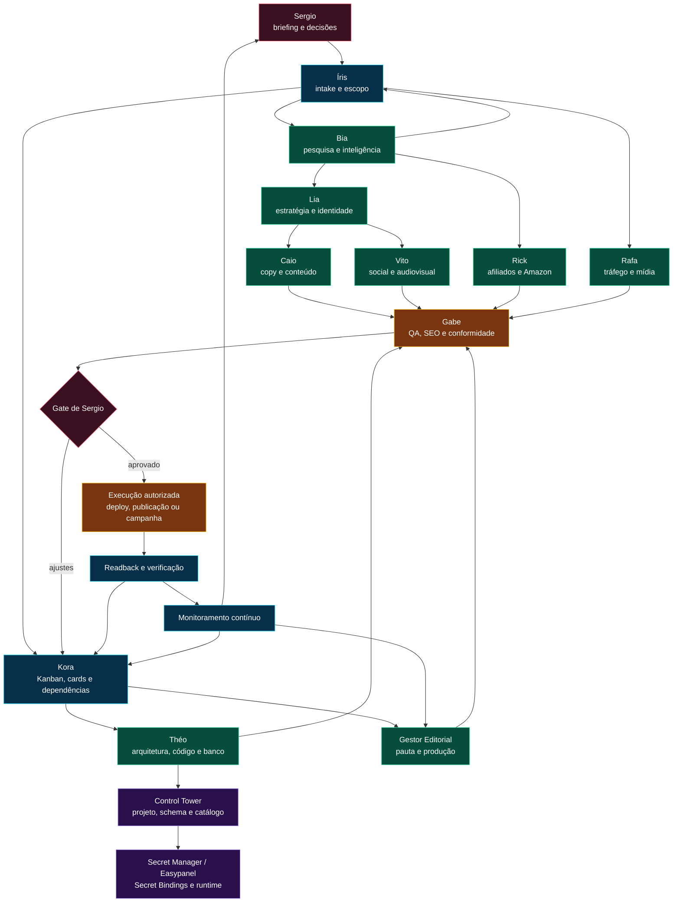

# FBR Agency Flux — equipe, funções e fluxo atual

## Status

`ATUAL` | documento operacional de referência

## Objetivo

Registrar a composição da equipe da FBR Agency, as responsabilidades de cada função e o fluxo genérico atual para criação, provisionamento, execução, aprovação, publicação e gestão contínua dos projetos

O FBR Agency Flux é transversal. Ele coordena os projetos, mas não substitui o Control Tower, o Kanban da Kora, os sistemas de produção ou os agents especialistas

## Equipe e funções

| Participante | Função | Responsabilidades principais | Recebe de | Entrega para |
|---|---|---|---|---|
| Sergio | Autoridade humana | Define prioridades, aprova decisões de risco, publicação, gasto, produção, arquitetura e ações irreversíveis | Íris, Kora e Gabe | Flux e agents responsáveis |
| David | Orquestração executiva | Coordena a implementação do Flux, valida artefatos, documenta decisões, executa verificações e mantém coerência entre projetos | Sergio e resultados dos agents | Sergio e equipe |
| Íris | Intake e orquestração | Recebe briefing, normaliza escopo, define objetivo, decompõe trabalho, distribui jobs e consolida handoffs | Sergio e Bia | Kora e agents |
| Kora | Kanban e estado operacional | Cria cards, project plan, dependências, prazos, riscos, blockers, gates e encerramento | Íris e agents | Sergio e equipe |
| Bia | Pesquisa e inteligência | Pesquisa nicho, público, mercado, concorrência, tendências, referências, fontes e limitações | Briefing | Íris, Caio e Lia |
| Théo | Engenharia e infraestrutura | Implementa código, banco, migrations, APIs, adapters, runtime, deploy, rollback e health checks | Requisitos, arquitetura e cards | Control Tower, Kora e Gabe |
| Control Tower | Governança de dados | Provisiona projetos, schemas, namespaces, Service Identities, Secret Bindings, handoffs e catálogo central | Théo/FBR Agency Flux | Projetos e runtime |
| Caio | Copy e conteúdo comercial | Cria posicionamento, copy de lançamento, páginas, mensagens, títulos, descrições e variações | Briefing, Bia e Lia | Íris, Lia, Gabe e publicação |
| Lia | Estratégia visual e planejamento | Converte pesquisa em direção estratégica, priorização, identidade visual, layout, hero, logo e especificações | Bia, briefing e Caio | Théo, Vito e Gestor Editorial |
| Vito | Redes sociais e audiovisual | Cria canais, calendário social, posts, vídeos, peças audiovisuais e adaptações para distribuição | Identidade, copy e plano | Íris, Caio, Gabe e Sergio |
| Rick | Afiliados e pesquisa de produtos | Pesquisa produtos, oportunidades Amazon Associates, giro, preço, disponibilidade, fontes e compliance | Nicho, público e regras Amazon | Gestor Editorial e Íris |
| Rafa | Tráfego e mídia | Analisa tráfego pago e orgânico, canais, orçamento, hipóteses, métricas, campanhas e otimizações | Objetivo, público, oferta e assets | Íris, Caio, Sergio e Gabe |
| Gestor Editorial | Operação editorial | Planeja pautas, escreve artigos, gerencia comentários, seleciona anúncios, usa Radar de Afiliados e envia drafts | Handoffs, dados e calendário | Gabe, Kora e Sergio |
| Gabe | QA, auditoria e gates técnicos | Valida qualidade, SEO, segurança, conformidade, evidências, critérios de aceite e prontidão | Artefatos dos agents | Kora e Sergio |
| Easypanel | Runtime e deploy | Executa serviços, Environment, deploy, restart, status e health conforme adapter autorizado | Control Tower/Théo | FBR Agency Flux |

## Regras de ownership

- Sergio é o único aprovador humano dos gates de risco
- Íris coordena, mas não substitui especialistas
- Kora é dona do estado do Kanban, mas não aprova em nome de Sergio
- Théo executa engenharia e infraestrutura, mas não amplia escopo sozinho
- Gabe pode bloquear uma entrega, mas não libera decisão humana
- Control Tower é autoridade do catálogo central e dos schemas provisionados
- Gestor Editorial não recebe a chave mestre do Control Tower nem `SUPABASE_SERVICE_ROLE_KEY`
- Agents recebem somente os acessos mínimos necessários ao job
- Toda passagem entre agents ocorre por card e Handoff

## Diagrama atual



## Fluxo de criação de projeto

```text
1. Sergio fornece briefing e objetivo
2. Íris normaliza escopo, dependências e critérios de aceite
3. Bia entrega pesquisa, fontes, contexto e limitações
4. Kora cria o project plan, cards, responsáveis e gates
5. Théo define arquitetura e requisitos de runtime
6. Control Tower provisiona o projeto e o schema
7. Secret Manager/Easypanel prepara o runtime por referências
8. Íris distribui os handoffs aos agents
9. Agents executam suas frentes em paralelo quando não houver dependências
10. Gestor Editorial, Caio, Lia, Vito, Rick e Rafa entregam seus artefatos
11. Gabe audita qualidade, segurança, SEO e critérios de aceite
12. Sergio aprova, rejeita ou solicita ajustes
13. Théo ou o responsável autorizado executa deploy, publicação ou campanha
14. Gabe verifica o resultado
15. Kora registra o readback e encerra o card
16. O projeto entra em monitoramento e manutenção contínua
```

## Estados operacionais

```text
planned
→ ready
→ in_progress
→ review
→ blocked | awaiting_approval
→ approved
→ executing
→ verifying
→ completed | failed
```

### Regras dos estados

- `blocked` exige motivo, severidade, responsável pelo desbloqueio e próximo passo
- `awaiting_approval` exige ação, impacto, escopo e rollback
- `approved` autoriza somente a ação registrada
- `completed` exige artefato e evidência
- `failed` exige erro sanitizado, impacto e recuperação

## Gates

| Gate | Objetivo | Responsável pela preparação | Decisor |
|---|---|---|---|
| G0 | Briefing, escopo e aceite | Íris | Sergio |
| G1 | Arquitetura, schema, ownership e riscos | Théo/Kora | Gabe e Sergio quando aplicável |
| G2 | Artefatos prontos e QA concluído | Agents/Gabe | Gabe |
| G3 | Publicação, gasto, deploy ou ação irreversível | Kora/Gabe | Sergio |
| G4 | Resultado externo verificado e card encerrado | Gabe/Kora | Kora |

## Interações obrigatórias

1. Íris abre o trabalho e define o contexto
2. Kora transforma o contexto em cards rastreáveis
3. Bia alimenta Íris, Caio e Lia com informação citada
4. Théo recebe requisitos técnicos e devolve evidências executáveis
5. Cada agent entrega um Handoff mínimo:

```text
CARD
ENTRADA
FEITO
ARTEFATO
FALTA/RISCOS
PRÓXIMO
EVIDÊNCIA
```

6. Gabe bloqueia inconsistências antes de Sergio receber a decisão
7. Sergio decide no card específico, nunca por inferência
8. O executor realiza somente o escopo aprovado
9. Kora registra o readback e o próximo ciclo

## Segurança

- Nenhum secret em Markdown, Git, frontend, logs ou Handoff
- Service Identities usam scopes mínimos
- Secret Bindings armazenam referências, não valores
- `SUPABASE_SERVICE_ROLE_KEY` permanece server-side
- Tokens revogados devem falhar imediatamente
- Falta de contrato de provider é bloqueio explícito
- Provisionamento e deploy devem ser executados no diretório efetivo da aplicação, normalmente `09-codigo`

## Diagrama visual HTML

Versão visual detalhada e validada:

`03-arquitetura/fbr-agency-flux-diagram.html`

Arquivo original:

`03-arquitetura/diagrama-fluxo-criacao-gestao.html`

## Critério de conclusão de um projeto

Um projeto só pode ser declarado concluído quando:

- briefing e aceite estão registrados
- cards e dependências estão completos
- arquitetura e schema foram validados
- provisionamento possui readback
- agents entregaram artefatos e evidências
- Gabe aprovou o QA
- Sergio aprovou os gates aplicáveis
- deploy/publicação foi verificado
- monitoramento foi iniciado
- histórico e documentação foram atualizados
