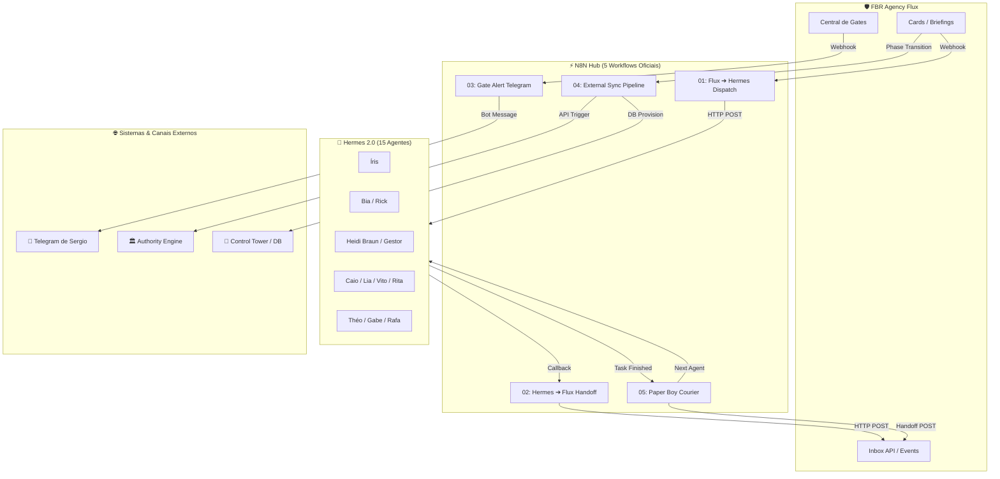

# 📘 Guia Operacional do N8N — Glue Code da FBR Agency

Este documento é o guia canônico de implantação, operação e governança dos workflows do **N8N** no ecossistema **FBR Agency Flux**. Ele explica a arquitetura de conexão, o funcionamento detalhado de cada fluxo, as variáveis de ambiente necessárias e o roteiro de testes.

---

## 1. Visão Geral da Arquitetura de Glue Code

O **N8N** atua como o **barramento de eventos assíncronos e integrador central (Glue Code)** da FBR Agency. Sua responsabilidade é garantir que:
1. Eventos e briefings criados no **Flux (Next.js / Supabase)** sejam despachados para os **Agentes Hermes 2.0**.
2. As entregas, artefatos e evidências dos agentes retornem de forma segura para o **Inbox do Flux**.
3. Ações de risco e decisões críticas (Gates G0 a G4) gerem **notificações imediatas para Sergio Castro no Telegram**.
4. Os subsistemas externos (**Authority Engine**, **Audience Builder**, **Sales Engine** e **Control Tower**) sejam sincronizados nas transições de fase.
5. O **Paper Boy Courier** transporte os contratos de Handoff entre agentes sem sobrecarga de tokens e sem fricção.



---

## 2. Detalhamento dos 5 Workflows Oficiais

---

### 🚀 Workflow 01: Dispatch do Flux para Agentes Hermes
* **Arquivo JSON:** [`01_flux_to_hermes_dispatch.json`](file:///f:/Projetos/_FBR/FBR%20Agency%20Flux/05-workflows/n8n/01_flux_to_hermes_dispatch.json)
* **Objetivo:** Escutar a criação de cards ou transição de etapas no Flux e acionar o agente Hermes responsável com as diretrizes e contexto necessários.
* **Trigger:** Webhook HTTP `POST /webhook/flux-event-receiver`
* **Mapeamento de Agentes:**
  - `Íris` ➔ Roteamento & decomposição de briefing
  - `Bia` ➔ Pesquisa de mercado e Amazon US
  - `Rick` ➔ Radar de afiliados e ClickBank
  - `Heidi Braun` / `Gestor Editorial` ➔ Pauta editorial e redação
  - `Caio` ➔ Copywriting comercial e LPs
  - `Lia` ➔ Direção visual e assets
  - `Vito` ➔ Roteiros de vídeo e Reels
  - `Rita` ➔ Listings Amazon e oferta
  - `Rafa` ➔ Mídia paga e tráfego
  - `Théo` ➔ Engenharia, banco e deploy
  - `Gabe` ➔ QA independente e conformidade
* **Payload de Entrada (Exemplo):**
```json
{
  "event": "card_assigned",
  "cardId": "CARD-0101",
  "project": "After Forty",
  "stage": "authority_engine",
  "assignee": "Bia",
  "detail": "Pesquisar os 3 principais suplementos de creatina para mulheres 45+ no mercado americano."
}
```

---

### 📥 Workflow 02: Retorno de Artefato do Hermes para o Flux (Handoff)
* **Arquivo JSON:** [`02_hermes_to_flux_handoff.json`](file:///f:/Projetos/_FBR/FBR%20Agency%20Flux/05-workflows/n8n/02_hermes_to_flux_handoff.json)
* **Objetivo:** Receber a entrega de um agente Hermes após a execução da tarefa e persistir a evidência diretamente no Inbox do Flux.
* **Trigger:** Webhook HTTP `POST /webhook/hermes-completion-callback`
* **Destino no Flux:** `POST /api/flux/inbox`
* **Payload de Entrada (Exemplo):**
```json
{
  "cardId": "CARD-0101",
  "agent_name": "Bia",
  "status": "completed",
  "output": "Relatório concluído com 3 ASINs selecionados e dados de volume mensal anexados.",
  "artifact_refs": ["artifacts/bia-creatine-research-2026.md"]
}
```

---

### 🚨 Workflow 03: Alerta de Gate Humano para Sergio (Telegram)
* **Arquivo JSON:** [`03_gate_notification_sergio.json`](file:///f:/Projetos/_FBR/FBR%20Agency%20Flux/05-workflows/n8n/03_gate_notification_sergio.json)
* **Objetivo:** Notificar imediatamente Sergio Castro via Telegram sempre que a esteira atingir um Gate de risco (G0 a G4) que exija decisão humana com motivo.
* **Trigger:** Webhook HTTP `POST /webhook/flux-gate-alert`
* **Formato da Mensagem no Telegram:**
```text
🚨 FBR Agency Flux: Gate Pendente de Decisão!

📌 Projeto: After Forty
🛡️ Gate: G3 — Aprovação de Verba de Mídia
👤 Responsável: Rafa
💵 Teto Solicitado: USD 50.00
📝 Justificativa: Campanha de validação de criativos no Meta Ads para o artigo de microcorrente.

👉 Decidir na Central de Aprovações:
https://flux.fbr.news
```

---

### 🔄 Workflow 04: Sincronização com Sistemas Externos & Control Tower
* **Arquivo JSON:** [`04_external_sync_pipeline.json`](file:///f:/Projetos/_FBR/FBR%20Agency%20Flux/05-workflows/n8n/04_external_sync_pipeline.json)
* **Objetivo:** Disparar rotinas nas APIs especializadas da agência quando um card avança de fase:
  - *Authority Engine*: Sincroniza banco de pautas e artigos.
  - *Audience Builder*: Provisiona campanhas e estruturas de criativos.
  - *Sales Engine*: Registra novas landing pages ou skus de afiliados.
  - *Control Tower*: Provisiona schema PostgreSQL e credenciais isoladas.
* **Trigger:** Webhook HTTP `POST /webhook/flux-pipeline-sync`

---

### 🚴‍♂️ Workflow 05: Paper Boy Courier (Roteador Leve de Handoffs)
* **Arquivo JSON:** [`05_paper_boy_courier.json`](file:///f:/Projetos/_FBR/FBR%20Agency%20Flux/05-workflows/n8n/05_paper_boy_courier.json)
* **Objetivo:** Funcionar como o mensageiro instantâneo entre os agentes da FBR Agency. Recebe o fim da tarefa de um agente, normaliza o contrato de Handoff e aciona o próximo agente no Hermes sem consumir cotas de LLM caras.
* **Trigger:** Webhook HTTP `POST /webhook/paper-boy-courier`
* **Nós do Workflow:**
  1. *Webhook Receiver*: Recebe o aviso de conclusão.
  2. *Code Node (JavaScript)*: Extrai `de`, `para`, `cardId`, `entregável` e `evidências`.
  3. *HTTP Request (Flux)*: Registra o Handoff no banco do Flux (`/api/flux/inbox`).
  4. *HTTP Request (Hermes)*: Dispara a notificação de início para o próximo agente.

---

## 3. Configuração de Variáveis de Ambiente no N8N

No painel do N8N ou no arquivo `.env` do container N8N, declare as seguintes variáveis:

```env
# URL Base da Aplicação Flux (Next.js)
FLUX_API_BASE_URL=https://flux.fbr.news

# Endpoint do Hermes para despacho de agentes
HERMES_API_BASE_URL=https://hermes.fbr.news/api/agent/run
HERMES_WEBHOOK_URL=https://hermes.fbr.news/hooks/agent-dispatch

# Endpoints dos Motores Especialistas
AUTHORITY_ENGINE_BASE_URL=https://sistemas-authority.pojxaz.easypanel.host
CONTROL_TOWER_BASE_URL=https://control-tower.fbr.news

# Credenciais do Bot de Notificação do Telegram
TELEGRAM_BOT_TOKEN=seu_bot_token_do_botfather
TELEGRAM_CHAT_ID=seu_chat_id_numerico_sergio
```

---

## 4. Passo a Passo para Importar os Workflows no N8N

1. Acesse o painel da sua instância N8N (ex: `https://n8n.fbr.news`).
2. No menu lateral esquerdo, clique em **Workflows**.
3. Clique no botão **Add Workflow** (ou no ícone `+`).
4. No canto superior direito da tela do fluxo, clique no menu de três pontos (`...`) e selecione **Import from File**.
5. Importe os 5 arquivos localizados em `05-workflows/n8n/`:
   - `01_flux_to_hermes_dispatch.json`
   - `02_hermes_to_flux_handoff.json`
   - `03_gate_notification_sergio.json`
   - `04_external_sync_pipeline.json`
   - `05_paper_boy_courier.json`
6. Clique no botão **Save** em cada workflow.
7. Alterne a chave no canto superior direito de cada fluxo para **Active** (`ON`).

---

## 5. Roteiro de Testes (Smoke Test de Validação)

Para validar a comunicação ponta a ponta, execute os testes abaixo via terminal (`curl` ou Postman):

### Teste 1: Testar o Paper Boy Courier
```bash
curl -X POST https://seu-n8n.fbr.news/webhook/paper-boy-courier \
  -H "Content-Type: application/json" \
  -d '{
    "de": "Bia",
    "para": "Heidi Braun",
    "cardId": "CARD-TEST-01",
    "entregavel": "Mapeamento de 3 ASINs de Creatina concluído",
    "evidencias": ["asin_b08xxxx", "asin_b09yyyy"],
    "status": "completed"
  }'
```
* **Resultado Esperado:** Retorno HTTP 200 e aparição do registro no painel do Flux.

### Teste 2: Testar Notificação de Gate no Telegram
```bash
curl -X POST https://seu-n8n.fbr.news/webhook/flux-gate-alert \
  -H "Content-Type: application/json" \
  -d '{
    "project": "After Forty",
    "gate": "G3 — Aprovação de Verba",
    "assignee": "Rafa",
    "budget": "USD 50.00",
    "justification": "Validação de criativos no Meta Ads"
  }'
```
* **Resultado Esperado:** Mensagem instantânea no Telegram de Sergio Castro com o link da Central de Aprovações.

---

## 6. Monitoramento & Resiliência com o FluxDoctor

Se algum webhook do N8N falhar ou o Hermes estiver temporariamente fora do ar:
1. O N8N possui retry automático configurado nos nós HTTP.
2. Qualquer falha persistente gera um log de erro capturado pela API `/api/flux/events`.
3. O assistente **FluxDoctor** (acessível no drawer lateral do Dashboard do Flux) analisa esses eventos em tempo real e fornece o diagnóstico exato e a solução para o operador.
